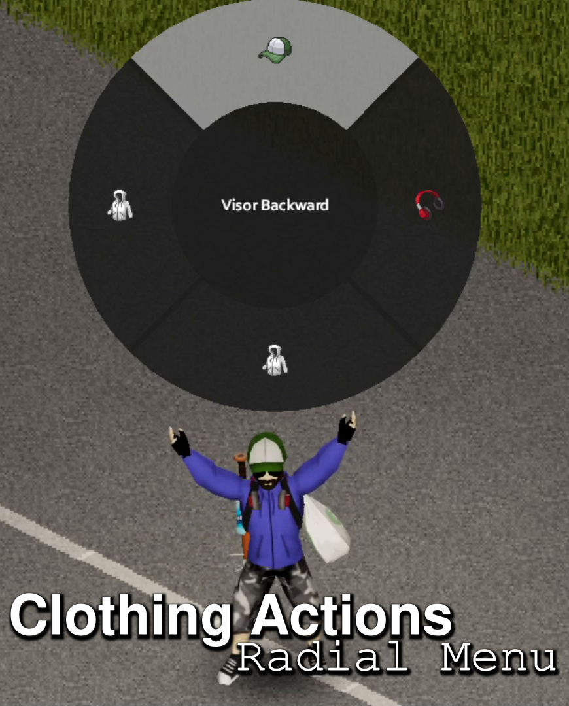

# Clothing Actions - Radial Menu



**Supports B41+. Works in Multiplayer**

A QOL mod for Project Zomboid that displays a Radial Menu for all Extra Clothing Actions that can be performed on currently worn items.  Less fumbling through your Inventory!

For example, gives quick access to turn your Hat, put up your Hoodie's Hood, and others!

This mod also adds a timer when performing an Extra Clothing Action instead of it being instant.  The time is half of the standard equip time, and actually allows your character to show an equip animation.  To compensate for this (small) added time, you can now walk during these actions.

Tested with (and highly recommend!):
- [Authentic Z](https://steamcommunity.com/sharedfiles/filedetails/?id=2335368829)
- [Spongie's Clothing](https://steamcommunity.com/sharedfiles/filedetails/?id=2684285534)

Should work with any other mods that add ExtraClothingOptions to item definitions too.

I'm not sure if this will work with controllers as this is not how I play Project Zomboid.  Also, not sure if this will work for other local players (shared screen co-op)

## Configuration

Default keybind is to the "Z" key.  Configurable in the "Keybinds" menu.

[ModOptions](https://steamcommunity.com/workshop/filedetails/?id=2169435993) is required for futher configuration, but the mod will function without.

- Disable Clothing Filter
    - Default: Disabled
    - Disables the filter for clothes. Show Actions on Bags (ex: Fanny Packs) and Watches
- Show Radial Menu Immediately on Press
    - Default: Disabled
    - Shows Radial Menu when key is pressed.  By default, a press and hold is required

## Translations

English

Spanish - [ElDoktor](https://github.com/fcastro97)

Thai - [radiusgreenhill](https://github.com/radiusgreenhill)

If you would like to contribute a translation, please submit a pull request!  I will happily credit here and on the Steam Workshop Page!

```
Workshop ID: 2786689104
Mod ID: ClothingActionsRM
```
