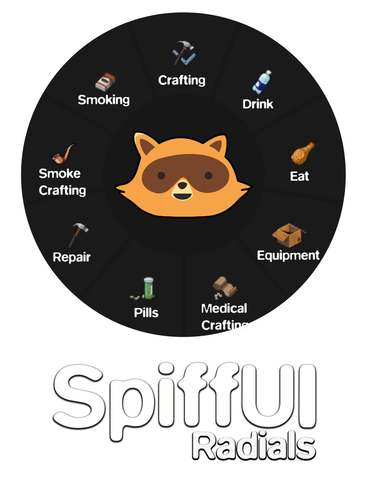

# SpiffUI Radials



**Supports B41+. Works in Multiplayer**

## SpiffUI - Radials

Adds 9 New Radials for easy interactions with the objects that are in your inventories and the world.  If a Radial is unavailable, your character will Say something.  Items return to their original location when used.

Included Radials:
- Crafting Radial
- Medical Craft Radial
- Smoke Craft Radial
- Equipment Radial
- Drink Radial
- Food Radial
- Pill Radial
- Repair Radial
- Smoke Radial

Possibly Next:
- Medical Radial - Would allow for quick access to any injuries.
- Inspect Radial - Port the Inspect Window to a Radial (I have this somewhat working)
- More Mod Compatibility

Got an idea for a Radial or any features I missed? Let me know!

### Included Base Game Fixes

These are small tweaks to Base Game Actions that I overall help the immersion of these Radials and the game overall.

- ISFixAction - (Repair)
    - Added an Animation when doing a Repair Action
- ISWearAction - (Wear Clothes)
    - Fixed the Rules for Equipping Clothes.  
        - You can now walk and equip any upper-body pieces of clothing (ie. shirts).
        - Your character now stops walking for lower-body clothes (ie. shoes).
        - This matches how the Unequip Actions works for these items
- ISClothingExtraActions - (Clothing Extra Actions)
    - Fixed the Rules for Clothing Extra Actions similarly to the ISWearAction
    - Added time (Half the Equip Time) to show an Animation

### Controlers!

Controllers are currently not supported.  The Radials are currently not designed to give focus to the Radial either so, really, don't try it please; it won't work.

There are simply too many radials to accomodate a controller at this time.  I have something in the works regarding this, but for now no controllers.

### Quick Actions

Some Radials have a "Quick Action" that is performed by a quick press of the key; the Radial is shown with a press and hold.  Each available quick action is explained further in the description.  If you set the Radial to be "Show on Press" the Quick Action will be disabled.

### Amount to Eat/Drink/Craft

Some actions can be performed on part or all of the items when you use the context menu, and these Radials can too!  A new Radial will appear asking to confirm how much if applicable.

You can also specify an amount to always perform by default in the ModOptions.

Quick Actions can only be set to an amount and will not ask.

### Radial Pages

The Radials will automatically paginate if enough items or recipes are available.  "Next" and "Previous" buttons will become available when applicable.

### Tooltips

The Tooltips have been ported to show in these Radials for all Recipes, Items, and Repairs.  When enabled, the item name does not appear in the middle of the Radial anymore.  This was a design decision as often the name is too long.  Besides, the name is in the Tooltip!  The Tooltips can be disabled, but are recommended.

**Known issue for the Recipe Tooltip:** I modified this from the default to prevent the lag from having too many items.  One side-effect of this is that sometimes an ingredient will be duplicated or listed in the wrong category.  This ONLY affects the Tooltip, the Recipe works as intended. 

### Recommended External Mods
Some Radials have external mod soft requirements listed below.  Each Radial will work without any external mods, however, certain features and apparent usefulness are only available with other mods.

- AutoSmoke by NoctisFalco: It is highly recommended that you use have this mod to unlock the full Smoke Radial Menu.  I use AutoSmoke's Item Filters and Actions to include support for the various cigarette mods in both the Smoke and Smoke Craft Radials.  Without this mod, you will still be able to smoke cigarettes but will be unable to interact with packs in the Smoke or Smoke Craft Radials. Either AutoSmoke or AutoSmoke-Stable can be used.

- Having AutoSmoke gives support for both Smoker by Nebula and More Cigarettes Mod by Madman_Andre.  ONE of these mods is recommended as well.

- jigga's Green Fire by jiggawut: Honestly, the reason I made the Smoke Craft Radial.  This mod is one of my personal favorites.  Adds items that populates the Radial.

- SpiffUI - Inventory: Modified behaviors to show and hide the Inventory Window, and part of SpiffUI!  

## SpiffUI Configuration

If ModOptions is installed (Recommended) SpiffUI will appear as a category.  This is intended to have common configuration across all of SpiffUI, as well as tools to help configure the game to SpiffUI recommendations.

- Set SpiffUI Recommended Keybinds
    - Default: (None) It's a Button!
    - Sets keybinds for built-in keys to recommended defaults.  A dialog will ask confirming this change, and will display the changes it will make.
- Run All SpiffUI Resets
    - Default: (None) It's a Button!
    - Runs all "Reset" functions for SpiffUI modules.  A user is able to change where the UI is, its size, etc.  This will set this to default.  A dialog will ask confirming this change, and will display the changes it will make.
    - **NOTE:** This will only be usable in-game.

## SpiffUI - Radials Configuration

- Show Tooltips
    - Default: True
    - Show Tooltips in Radial Menus for Items, Recipes, and Repairs (Recommended)
- Hide Crafting Button
    - Default: True
    - Hides the Crafting button in the left sidemenu

## Radials

### Crafting Radial

Unlock the full power of Crafting with the Crafting Radial!  Shows available recipes for items that can be performed for items on the player and in the world.  

**Default Key:** `B`

By default, this changes the behavior so pressing the key opens the Radial while a long press will open the Crafting window.

**Configuration:**
- Show on Press (Crafting)
    - Default: True
    - Press Opens Radial Menu, Hold for Crafting Window
- Show Recipes on Equipped Items (Crafting)
    - Default: False
    - Note: Recipes on worn items can be done from the Equipment Menu.  Items in your hand will still show recipes
- Show Smokeable Recipes (Crafting)
    - Default: False
    - Consider using the Smoke Crafting Menu instead!
- Show Medical Recipes (Crafting)
    - Default: False
    - Note: Some Recipes may still filter through.  For example, having a Plank and Ripped Sheets will still the recipe for a Splint due to the Plank.  Consider using the First Aid Crafting Menu instead!
- Craft Amount (Crafting)
    - Default: Ask
    - How many to craft (Only shows if more than 1 is available)
- Filter Duplicate Recipes (Crafting)
    - Default: True
    - Filters Duplicate Crafting Recipes to help de-clutter the Radial

### Medical Craft Radial

Easy Access to those life-saving crafing recipes quick!  

**Default Key:** `;`

Shows on press

**Configuration:**
- Craft Amount (Medical Craft)
    - Default: Ask
    - How many to craft (Only shows if more than 1 is available)

### Smoke Craft Radial

Want to role-play as a hipster who rolls their own cigarettes?  Or a stoner who is always keeping things packed?  Or maybe you're just classy and only smoke from a pipe?  Here's for you!

This Radial may be a bit niche, but hey we're just having fun!

**Default Key:** `\`

Shows on press

**Configuration:**
- Show Dismantle Recipes (Smoke Craft)
    - Default: True
    - Shows Recipes to Break/Unpack Items
- Show Cigarette Packs (Smoke Craft)
    - Default: False
    - Shows the Unpack actions on cigarettes
- Amount To Craft (Smoke Craft)
    - Default: Ask
    - How many to craft (Only shows if more than 1 is available)


### Equipment Radial

A Radial that shows equipped items from Head-to-Toe!  Accessories, such as Glasses, Jewelry, etc, and items in your Hotbar are organized in a submenu to help declutter the Radial.  

Selecting an item gives many of the same options as the Context Menu such as Unequiping, "Inspect" (shows the Insepct Window), any Recipes (configurable), Repairs, and item-specific interactions!

**Default Key:** `Tab`

Press and hold

**Configuration:**

- Show Drop Action (Equipment)
    - Default: True
    - Shows Option to Drop an item
- Show Unavailable Repair Options (Equipment)
    - Default: False
    - Shows all Repair Recipes even if you don't have the items/skills
- Show Extra Clothing Actions (Equipment)
    - Default: True
    - Shows "Extra Clothing Actions" on clothing Items (Putting up the Hood, Turning your hat, etc)
- Show Recipes (Equipment)
    - Default: True
    - Shows available Recipes for an item

### Drink Radial

Shows available drinks on or around your character.  There's a Zombie Apocolypse, no one will blame you for chugging that warm 2-liter of Orange Soda 90+ days in.  Also perfect for an Alcoholic on-the-go who loves choice!  

**Default Key:** `{`

**Quick Action:** Drink!

Drinks water or the first found drinkable in your inventory if you are Thirsty.  If Water, drinks how much you need.  Otherwise uses the "Amount to Quick Drink" setting.

**WARNING** Poisons **WILL** appear in the Radial and can be chosen for the Quick Action if your character doesn't know its Poisonous!!!!

**Configuration:**

- Amount to Drink (Drink)
    - Default: Ask
    - How much to Drink
- Amount to Quick Drink (Drink)
    - Default: All
    - How much to Drink on Quick Action
- Show Radial on Press (Drink)
    - Default: False
    - Shows the Drink Radial on Press.  Disables the Quick Drink Action

### Food Radial

Shows available food on or around your character.  We all get Snacky.

**Default Key:** `}`

**Quick Action:** Eat a Snack!

Eats the food item in your inventory that has the lowest Hunger Change.

**Configuration:**

- Amount to Eat (Food)
    - Default: Ask
    - How much to Eat
- Amount to Quick Eat (Food)
    - Default: All
    - How much to Eat on Quick Action
- Show Radial on Press (Food)
    - Default: False
    - Shows the Food Radial on Press.  Disables the Quick Eat Action

### Pill Radial

Shows available pills on or around your character. 

**Default Key:** `'`

**Quick Action:** Take Needed Pills

Takes the pills to control Moodlets!  Supports "Pain Pills", "Vitamins", "Beta Blockers", and "Antidepressents". Will attempt to take ALL needed pills.

**Configuration:**
- Show Radial on Press (Pills)
    - Default: False
    - Shows the Pill Radial on Press.  Disables the Quick Pills Action

### Repair Radial

Shows available Repairs for items on or around your character.  

**Default Key:** `N`

Shows on press

**Configuration:**

- Show Repairs on Equipped Items (Repair)
    - Default: False
    - Can instead be done from the Equipment Radial! Note, the items in your Hands will still show
- Show Repairs for Items in Hotbar (Repair)
    - Default: False
    - Can instead be done from the Equipment Radial! Note, the items in your Hands will still show

### Smoke Radial

Shows available Smokeables on or around your character.  A Lighter or Matches is required in order to display items.

**Default Key:** `Backspace`

**Quick Action:** AutoSmoke 

If AutoSmoke is not enabled, there is no Quick Action

**Configuration:**

- Show Cigarette Butts (Smoke)
    - Default: False
    - Show Cigarette Butts if added by a Mod
- Show Gum (Smoke)
    - Default: True
    - Show Nicotine Gum if added by a Mod
- Show Radial on Press (Smoke)
    - Default: False
    - Shows the Smoke Radial on Press.  Disables the AutoSmoke Quick Action

## Translations

English

Russian - fourteensix

If you would like to help with translations, please submit a Pull Request.


```
Workshop ID: 2802525922
Mod ID: SpiffUI-Rads
```